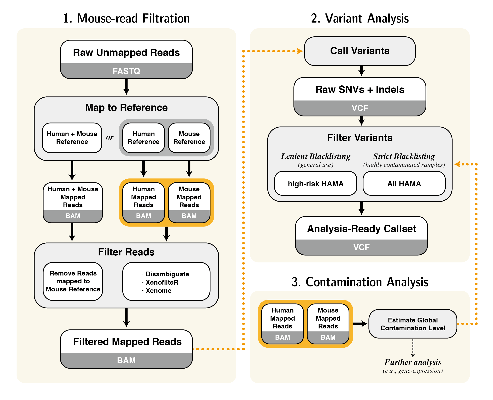

# Best Practice for Analysis of PDM sequencing

## Introduction

A robust workflow to analyze human genome data contaminated by mouse genome. ConcatRef, Disambiguate and XenofilteR are the best suggested filtering method for general purpose. Alternatively, Xenome, XenofilteR and ConcatRef are also recommended for SNV analysis. After applying filtering method, further filtering can be achieved by blacklisting using HAMA list. Estimation of contamination ratio can be used as an indicator of whether strict or lenient blacklisting should be applied.

## Description

+ **Filtering Methods**
  + BBsplit
  + Bamcmp
  + ConcatRef
  + Disambiguate
  + TwinRef-L
  + TwinRef-S
  + XenofilteR
  + Xenome

+ **HAMA blacklisting**
  + SNV calling should be preceded.
  + [__Download HAMAlist__](https://github.com/ShockYoung/BestPractice_for_PDMseq/releases/download/HAMAlist/HAMAlist.gnomad.mouse.tsv)
  
+ **MouseContamEstimator**
  + Simple script for calculating estimated contamination level.
  

## Reference

Se-Young Jo, Eunyoung Kim, Sangwoo Kim: **Impact of Mouse contamination in genomic profiling of patient-derived model and best practice for robust analysis**, *under revision*
